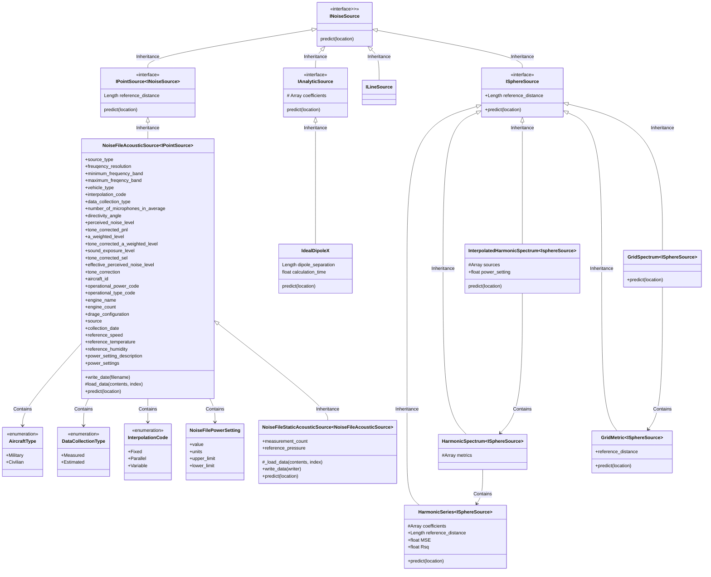

#  physical_sources

This is a collection of classes meant to provide access to acoustic source levels that were contained within the initial
release of the Counter Listener Acoustic Warfare Software (CLAWS). But with the changes to the releasibility of the code
and data from CLAWS, a number of classes were removed from the distribution. 

