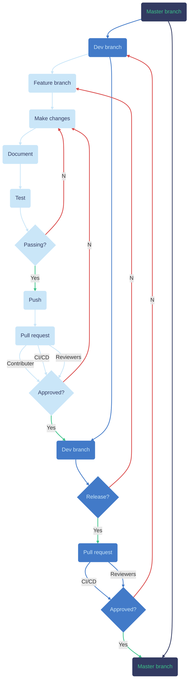

# tidal


Regulated science tools for TidalSense.

## Table of contents

- [tidal](#tidal)
  - [Table of contents](#table-of-contents)
  - [Usage](#usage)
  - [Development](#development)
    - [Setup environment](#setup-environment)
    - [Repository development workflow](#repository-development-workflow)
      - [Testing](#testing)
      - [Documentation](#documentation)
      - [Versioning](#versioning)
  - [Contact us](#contact-us)

## Usage

Allow your virtual environment to pull from our private Python package index by filling in the path to your virtual environment directory on the first line of this command and running in the terminal:

```zsh
ENV_DIR_PATH=INSERT_YOUR_ENV_DIR_PATH_HERE
touch $ENV_DIR_PATH/pip.conf
echo "[global]\nextra-index-url = https://europe-west2-python.pkg.dev/athens-infrastructure/crispi/simple/" > $ENV_DIR_PATH/pip.conf
```

Now you may install the package like any other:

```zsh
pip install tidal
```

You may now use it in your Python development:

```python
import tidal
```

## Development

### Setup environment

These instructions assume that you are on MacOS. If you are using Linux, we will assume that you are capable enough to tailor these steps for your system. If you are on Windows... I'm sorry:

1. Ensure that you have the following VSCode extensions installed:
   - [Python](https://marketplace.visualstudio.com/items?itemName=ms-python.python)
   - [EditorConfig](https://marketplace.visualstudio.com/items?itemName=EditorConfig.EditorConfig)
   - [Python Docstring Generator](https://marketplace.visualstudio.com/items?itemName=njpwerner.autodocstring)
      - Go to the extension settings and set the default docstring type to Sphinx.
   - [Live Server](https://marketplace.visualstudio.com/items?itemName=ritwickdey.LiveServer).
1. Clone the `tidal` repository locally using

   ```zsh
   git clone https://github.com/camresp/tidal.git
   ```

1. If not already on your machine, install the convenient package manager [homebrew](https://brew.sh/).
1. Using homebrew, install [`pyenv`](https://github.com/pyenv/pyenv):

   ```zsh
   brew install pyenv
   echo 'export PYENV_ROOT="$HOME/.pyenv"' >> ~/.zshrc
   echo 'command -v pyenv >/dev/null || export PATH="$PYENV_ROOT/bin:$PATH"' >> ~/.zshrc
   echo 'eval "$(pyenv init -)"' >> ~/.zshrc
   ```

   - Since you have just added these to your path, you should close down your terminal and re-open it.
1. Ensure that you have [gcloud CLI](https://cloud.google.com/sdk/docs/install) installed:
   - If you are installing now, you will at some point run `gcloud init`, during which you should:
      - select `Create a new configuration`,
      - set the configuration name to whatever you want (it doesn't matter),
      - set the `project` to `tidal` (proceed even if it tells you that this project does not exist),
   - Ensure that your location is correctly set:

      ```zsh
      gcloud config set artifacts/location europe-west2
      ```

   - > Note: Downloading may not work with Python 3.11+. If you run into issues, use `pyenv` to install an older version of Python, e.g. Python 3.9.9, and, inserting `INPUT_YOUR_VERSION`, run in terminal (feel free to ask for help if you have any issues with this):

      ```zsh
      echo 'export CLOUDSDK_PYTHON="$HOME/.pyenv/versions/INPUT_YOUR_VERSION/bin/python3"' >> ~/.zshrc
      ```

1. Create a new environment, including your chosen version of Python3 in the first line:

   ```zsh
   make env v=3.11.x
   source .venv/bin/activate
   ```

1. Read the rest of this `README.md` to familiarise yourself with how to maintain best practices.

### Repository development workflow

Branches:

- Master
  - In production.
- Dev
  - Consolidates new features before an update to production.
- Feature branches
  - Build new functionality.

The workflow is summarised within the following flowchart:



#### Testing

Before you make any pull requests, ensure that your changes do not break any tests:

- For more extensive tests that install the package in multiple versions of Python, run `pytest`, check code quality, and check that documentation builds, amongst other things, in the terminal run:

   ```zsh
   pyenv shell 3.11.x
   tox
   ```

   where you will need to set `x` to match a version of Python that you have installed in your `pyenv versions` list such that `tox` can know to use them.
   > Note: After this runs successfully, you will notice an `htmlcov` folder is generated for each version of Python that was tested. If you navigate into these directories, right-click on `index.html`, and click `Open with Live Server`, you will be able to view which lines of code your tests touched.
- For quicker tests only using your environment, that can be used more quickly while writing code, in the terminal run:

   ```zsh
   pytest
   ```

- We should aim to have 100% code coverage.

#### Documentation

[Sphinx docstrings](https://sphinx-rtd-tutorial.readthedocs.io/en/latest/docstrings.html) should be used throughout code, with doctests if also useful to show examples.

At each pull request, you should ensure that you have followed the following code to make sure the documentation is up-to-date:

- When adding a new object to an existing sub-package:
  - this will simply only require writing the docstring for the required objects in the `.py` file, and then listing those objects that you would like to appear in the HTML documentation (i.e. those imported in the `__init__.py`) in the relevant `docs/source/python-api/*.rst` file.
- When adding a new sub-package (i.e. a new folder):
  - this will require creating a new `docs/source/python-api/*.rst` whose format can be copied across from an existing one.

   > Note: You should only ever need to edit the `docs/source/python-api/*.rst` files, and never anything inside any of the folders within `docs/source/python-api`, since these are auto-generated.

To view/develop the documentation in an HTML format:

1. To build the documentation, run the following command in the terminal from the root of this repository's directory:

   ```zsh
   make doc
   ```

1. Navigate to

   ```zsh
   .
   └── docs
       └── build
           └── html
               └── index.html
   ```

    right-click and select `Open with Live Server`.

#### Versioning

- Version numbers are usually given as `major.minor.patch`. This is how the `__version__` variable in `src/tidal/__init__.py` should be specified when merging from `dev` into `master`.
  - Patches:
    - Only bugfixes or performance enhancements.
  - Minor:
    - Backwards-compatible updates, e.g. additional functionality.
  - Major:
    - Breaking changes, e.g. removing functionality or updating existing functionality.
- Having specified the `__version__` correctly before merging into `master`, [GitHub workflow](.github/workflows/release.yaml) will take care of packaging and releasing automatically.
- When creating a development version that you would like to upload to the package index, version numbers such as `major.minor.patch.devN` can be used, for example, `0.1.2.dev0` would be the first development release of version `0.1.2`.

## Contact us

```topojson
{
    "type":"Topology",
    "transform": {
        "scale": [0.007, 0.007],
        "translate": [0.1220, 52.2032]
    },
    "objects": {
        "cambridge": {
            "type": "GeometryCollection",
            "geometries": [
                {
                    "type": "Polygon",
                    "arcs": [[0]],
                    "properties": {"Location": "Cambridge"}
                }
            ]
        },
        "the-vinery": {
            "type": "GeometryCollection",
            "geometries": [
                {
                    "type": "Point",
                    "coordinates": [4.115, -0.8],
                    "properties": {
                        "Company": "TidalSense Limited",
                        "Address": "The Vinery, 15a Vinery Road, Cambridge, CB1 3DN",
                        "Email": "info@tidalsense.com"
                    }
                }
            ]
        }
    },
    "arcs": [
        [[-2.65, -6.15], [13.67, 2.08], [-1.05, 5.22], [-5.88, 3.8], [-14.57, -4.37], [8, -2.38]]
    ]
}
```
